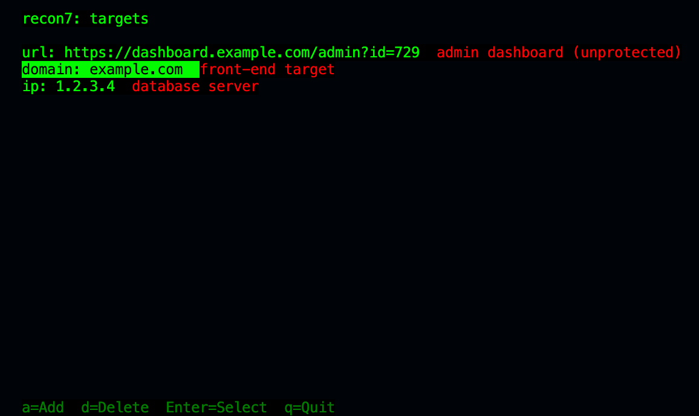
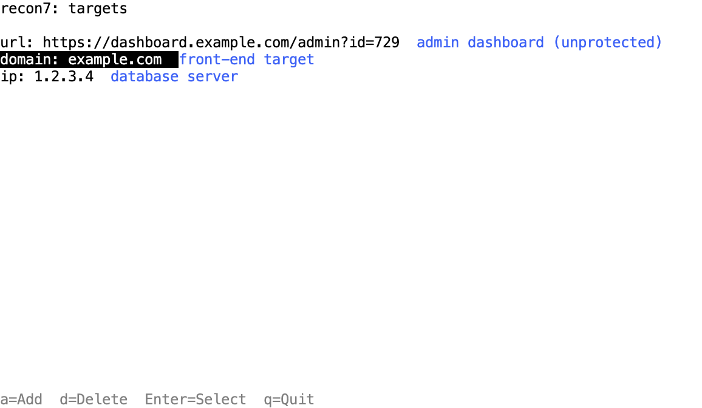

# recon7
A powerful and modular recon swiss army knife made in Python.

***DISCALIMER: Intended for educational/legal purposes ONLY. Don't misuse it.***
## Features
recon7 has a range of features that make it easy to work with and extend
### Modular config
We use a simple, custom configuration language (7cfg) built to make it easy to organize typed values, targets, secrets, and more. Here's an example:
```js
// default (preconfed) targets
target:url "https://example.com" "Example URL"
target:domain "example.com" "Example domain"
target:ip "1.2.3.4" "Example IP"
// basically string values
secret:api-ninjas "a1b2c3d4e5f6"
// numbers (ints and floats)
num:req-wait 1000
```
In addition, the `sevenconfig` module included in the code makes it easy to integrate recon7 config files into other (Python-based) software.
### TUI



recon7 uses a fully themable TUI that gives it a number of advantages. While they have a steeper learning curve, they are much faster to operate for familiar users, additionally, most hackers and security researchers are already familiar with text based interfaces.